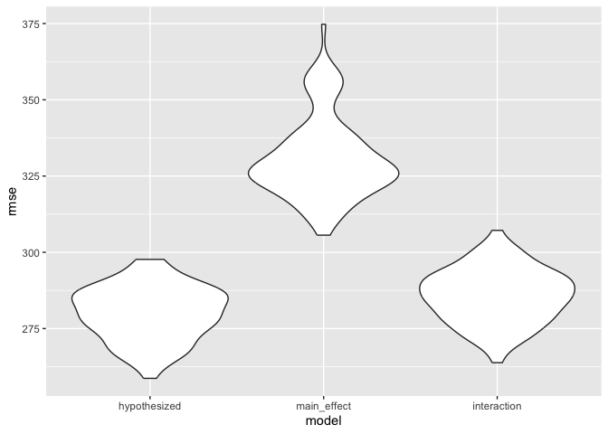

Homework 6
================
Sarah Younes

As always, I will begin by loading necessary packages: `tidyverse`,
`modelr`, and `mgcv`. Additionally, I will set my seed for
reproducibility.

``` r
library(tidyverse)
library(modelr)
library(mgcv)
set.seed(1)
```

## Problem 1

First, I will import and clean the data, including filtering the data to
necessary items.

``` r
homicide_data =
  read.csv(
    "./data/homicide-data.csv",
    na = "Unknown") |>
  janitor::clean_names() |>
  drop_na() |>
  mutate(
    victim_last = str_to_title(victim_last),
    victim_first = str_to_title(victim_first),
    city_state = paste(city, state, sep = ", "),
    victim_age = as.numeric(victim_age),
    status = case_when(
      disposition == "Closed without arrest" ~ "Solved",
      disposition == "Closed by arrest" ~ "Solved",
      disposition == "Open/No arrest" ~ "Unsolved")) |>
  filter(!(city_state %in% c("Dallas, TX", "Phoenix, AZ", "Kansas City, MO", "Tulsa, OK"))) |>
  filter(victim_race == "White" | victim_race == "Black")
```

Now, I will fit a logistic regression for Baltimore, MD with `status` as
the outcome and `victim_age`, `victim_sex`, and `victim_race` as
predictors. I will tidy the output and obtain an estimate of the odds
ratio.

``` r
regression_data =
  homicide_data |>
  mutate(
    status = case_when(
      status == "Solved" ~ 1,
      status == "Unsolved" ~ 0))

status_fit =
  glm(status ~ victim_age + victim_sex + victim_race, data = regression_data, family = "binomial") |>
  broom::tidy() |>
  mutate(OR = exp(estimate))

status_fit
```

    ## # A tibble: 4 × 6
    ##   term              estimate std.error statistic   p.value    OR
    ##   <chr>                <dbl>     <dbl>     <dbl>     <dbl> <dbl>
    ## 1 (Intercept)       0.708     0.0402      17.6   2.23e- 69 2.03 
    ## 2 victim_age        0.000609  0.000784     0.777 4.37e-  1 1.00 
    ## 3 victim_sexMale   -0.803     0.0331     -24.3   2.80e-130 0.448
    ## 4 victim_raceWhite  0.798     0.0331      24.1   9.84e-129 2.22

## Problem 2

First, I will download the cleaned weather data set as instructed.

``` r
weather_df = 
  rnoaa::meteo_pull_monitors(
    c("USW00094728"),
    var = c("PRCP", "TMIN", "TMAX"), 
    date_min = "2022-01-01",
    date_max = "2022-12-31") |>
  mutate(
    name = recode(id, USW00094728 = "CentralPark_NY"),
    tmin = tmin / 10,
    tmax = tmax / 10) |>
  select(name, id, everything())
```

I will now create a simple linear regression with `tmax` as the outcome
and `tmin` and `prcp` as the predictors.

``` r
tmax_fit = lm(tmax ~ tmin + prcp, data = weather_df)

tmax_fit
```

    ## 
    ## Call:
    ## lm(formula = tmax ~ tmin + prcp, data = weather_df)
    ## 
    ## Coefficients:
    ## (Intercept)         tmin         prcp  
    ##    8.042803     1.013386    -0.001541

Next, I will draw 5,000 bootstrap samples using `modelr::bootstrap` and
produce estimates of r-squared using `broom::glance`.

``` r
r2_bootstrap =
  weather_df |>
  modelr::bootstrap(n = 5000) |>
  mutate(
    models = map(strap, \(weather_df) lm(tmax ~ tmin + prcp, data = weather_df)),
    results = map(models, broom::glance),
    sample_number = row_number()) |>
  unnest(results) |>
  select(sample_number, r.squared)

r2_bootstrap
```

    ## # A tibble: 5,000 × 2
    ##    sample_number r.squared
    ##            <int>     <dbl>
    ##  1             1     0.898
    ##  2             2     0.928
    ##  3             3     0.925
    ##  4             4     0.931
    ##  5             5     0.915
    ##  6             6     0.918
    ##  7             7     0.922
    ##  8             8     0.910
    ##  9             9     0.910
    ## 10            10     0.939
    ## # ℹ 4,990 more rows

I will draw 5,000 bootstrap samples using `modelr::bootstrap` and
produce estimates of log(β̂ 1∗β̂ 2) using `broom::tidy()` and
`pivot_wider`.

``` r
log_bootstrap =
  weather_df |>
  modelr::bootstrap(n = 5000) |>
  mutate(
    models = map(strap, \(weather_df) lm(tmax ~ tmin + prcp, data = weather_df)),
    results = map(models, broom::tidy),
    sample_number = row_number()) |>
  unnest(results) |>
  filter(term %in% c("prcp", "tmin")) |>
  pivot_wider(
    id_cols = sample_number,
    names_from = term,
    values_from = estimate) |>
  mutate(
    log = log(tmin * prcp))

log_bootstrap
```

    ## # A tibble: 5,000 × 4
    ##    sample_number  tmin      prcp    log
    ##            <int> <dbl>     <dbl>  <dbl>
    ##  1             1 0.998  0.00236   -6.05
    ##  2             2 0.988  0.00103   -6.89
    ##  3             3 1.02  -0.00200  NaN   
    ##  4             4 1.02  -0.00681  NaN   
    ##  5             5 1.02   0.000945  -6.95
    ##  6             6 0.997  0.00776   -4.86
    ##  7             7 1.01   0.000538  -7.52
    ##  8             8 1.02  -0.00110  NaN   
    ##  9             9 1.04  -0.00472  NaN   
    ## 10            10 1.01   0.000396  -7.83
    ## # ℹ 4,990 more rows

Since β̂ 2 is negative, 66.08 % of estimates of log from the bootstrap
samples were negative and thus returned NaN.

Now, I will plot the distribution of the estimates of r-squared and
log(β̂ 1∗β̂ 2) from the bootstrap samples.

``` r
r2_bootstrap |>
  ggplot(aes(x = r.squared)) + geom_density()
```

<!-- -->

The density plot for r-squared is unimodal and slightly left-skewed. It
shows that the peak is around the mean, which is 0.92. The minimum is
0.87 and the maximum is 5000. These r-squared values indicate that the
model (in other words, minimum temperature and average precipitation)
predicts over 86.57% and an average of 91.6834935% of the variability in
maximum temperature. These r-squared values indicate that the model is a
great fit.

``` r
log_bootstrap |>
  ggplot(aes(x = log)) + geom_density()
```

    ## Warning: Removed 3304 rows containing non-finite values (`stat_density()`).

<!-- -->

The density plot for log(β̂ 1∗β̂ 2) is unimodal and more heavily
left-skewed. The peak is greater than the mean of -6.0883409. The
minimum is NaN and the maximum is NaN.

Finally, I will identify the 2.5% and 97.5% quantiles to provide a 95%
confidence interval for r-squared and log(β̂ 1∗β̂ 2). However, I dropped
negative log values from the bootstrap sample to construct confidence
intervals for estimates that are not missing.

``` r
r2_bootstrap |>
  summarize(
    ci_lower = quantile(r.squared, 0.025),
    ci_upper = quantile(r.squared, 0.975))
```

    ## # A tibble: 1 × 2
    ##   ci_lower ci_upper
    ##      <dbl>    <dbl>
    ## 1    0.889    0.941

``` r
log_bootstrap |>
  drop_na(log) |>
  summarize(
    ci_lower = quantile(log, 0.025, na.rm = TRUE),
    ci_upper = quantile(log, 0.975, na.rm = TRUE))
```

    ## # A tibble: 1 × 2
    ##   ci_lower ci_upper
    ##      <dbl>    <dbl>
    ## 1    -8.88    -4.60

We are 95% confident that the true r-squared value lies between
0.8885495 and 0.9406812 and that the true positive log(β̂ 1∗β̂ 2) (since
we dropped negative log values) lies between -8.8847595 and -4.6039854.

These confidence intervals for r-squared and log(β̂ 1∗β̂ 2) are not
surprising given the previous density plots.

## Problem 3

I will import and start to clean the birthweight data set. Data cleaning
involves removing “Unknown” race values and converting numeric values to
factors. (I will finish data cleaning later because I could not run part
of my code later if I set `babysex` or `malform` as factors.)

``` r
birthweight_df =
  read_csv("./data/birthweight.csv") |>
  filter(frace != 9) |>
  mutate(
    frace = as.factor(frace),
    mrace = as.factor(mrace))
```

I will use a combination of a data-driven and theory/hypothesis-driven
modeling process to propose a regression model for birthweight.

I will use run statistical tests to look at the relationship between the
continuous outcome, `bwt`, and each independent variable. However, I am
automatically excluding `pnumlbw` and `pnumsga` as potential independent
variables because their values across the entire sample were all 0, so
there cannot be any trends between them and `bwt`.

For continuous independent variables, I will run Pearson’s correlation
using `cor.test`; for binary categorical independent variables, I will
run independent samples t-tests using `t.test`; and for categorical
independent variables with three or more values, I will run ANOVA using
`aov`.

Here are the steps I will take and criteria I will use:

1.  I will run the statistical tests.

2.  I will only consider p-values that are statistically significant at
    p\<0.05.

3.  I will use the following criteria to narrow down my independent
    variables:

    - For statistically significant continuous independent variables
      (tested with Pearson’s correlation): the correlation coefficient
      estimate must be \>0.7 to indicate a strong correlation.
    - For statistically significant categorical independent variables
      (tested with independent samples t-tests and ANOVA): I will look
      at the existing literature online to determine have the strongest
      relationships AND there must be enough values of all the
      categories in the birthweight data set to notice differences in
      birthweight by category.

I will include the variables with the strongest numeric and/or
theoretical relationships in my model based on the criteria above.

Here are my statistical tests:

``` r
cor.test(pull(birthweight_df, bwt), pull(birthweight_df, bhead), method = "pearson") |> broom::tidy()
```

    ## # A tibble: 1 × 8
    ##   estimate statistic p.value parameter conf.low conf.high method     alternative
    ##      <dbl>     <dbl>   <dbl>     <int>    <dbl>     <dbl> <chr>      <chr>      
    ## 1    0.747      74.0       0      4340    0.734     0.760 Pearson's… two.sided

``` r
cor.test(pull(birthweight_df, bwt), pull(birthweight_df, blength), method = "pearson") |> broom::tidy()
```

    ## # A tibble: 1 × 8
    ##   estimate statistic p.value parameter conf.low conf.high method     alternative
    ##      <dbl>     <dbl>   <dbl>     <int>    <dbl>     <dbl> <chr>      <chr>      
    ## 1    0.743      73.2       0      4340    0.730     0.756 Pearson's… two.sided

``` r
cor.test(pull(birthweight_df, bwt), pull(birthweight_df, delwt), method = "pearson") |> broom::tidy()
```

    ## # A tibble: 1 × 8
    ##   estimate statistic  p.value parameter conf.low conf.high method    alternative
    ##      <dbl>     <dbl>    <dbl>     <int>    <dbl>     <dbl> <chr>     <chr>      
    ## 1    0.288      19.8 1.22e-83      4340    0.260     0.315 Pearson'… two.sided

``` r
cor.test(pull(birthweight_df, bwt), pull(birthweight_df, fincome), method = "pearson") |> broom::tidy()
```

    ## # A tibble: 1 × 8
    ##   estimate statistic  p.value parameter conf.low conf.high method    alternative
    ##      <dbl>     <dbl>    <dbl>     <int>    <dbl>     <dbl> <chr>     <chr>      
    ## 1    0.155      10.3 1.26e-24      4340    0.125     0.183 Pearson'… two.sided

``` r
cor.test(pull(birthweight_df, bwt), pull(birthweight_df, gaweeks), method = "pearson") |> broom::tidy()
```

    ## # A tibble: 1 × 8
    ##   estimate statistic   p.value parameter conf.low conf.high method   alternative
    ##      <dbl>     <dbl>     <dbl>     <int>    <dbl>     <dbl> <chr>    <chr>      
    ## 1    0.412      29.8 9.69e-178      4340    0.387     0.437 Pearson… two.sided

``` r
cor.test(pull(birthweight_df, bwt), pull(birthweight_df, menarche), method = "pearson") |> broom::tidy()
```

    ## # A tibble: 1 × 8
    ##   estimate statistic p.value parameter conf.low conf.high method     alternative
    ##      <dbl>     <dbl>   <dbl>     <int>    <dbl>     <dbl> <chr>      <chr>      
    ## 1  -0.0244     -1.61   0.108      4340  -0.0541   0.00532 Pearson's… two.sided

``` r
cor.test(pull(birthweight_df, bwt), pull(birthweight_df, mheight), method = "pearson") |> broom::tidy()
```

    ## # A tibble: 1 × 8
    ##   estimate statistic  p.value parameter conf.low conf.high method    alternative
    ##      <dbl>     <dbl>    <dbl>     <int>    <dbl>     <dbl> <chr>     <chr>      
    ## 1    0.192      12.9 2.18e-37      4340    0.163     0.221 Pearson'… two.sided

``` r
cor.test(pull(birthweight_df, bwt), pull(birthweight_df, momage), method = "pearson") |> broom::tidy()
```

    ## # A tibble: 1 × 8
    ##   estimate statistic  p.value parameter conf.low conf.high method    alternative
    ##      <dbl>     <dbl>    <dbl>     <int>    <dbl>     <dbl> <chr>     <chr>      
    ## 1    0.136      9.03 2.57e-19      4340    0.106     0.165 Pearson'… two.sided

``` r
cor.test(pull(birthweight_df, bwt), pull(birthweight_df, parity), method = "pearson") |> broom::tidy()
```

    ## # A tibble: 1 × 8
    ##   estimate statistic p.value parameter conf.low conf.high method     alternative
    ##      <dbl>     <dbl>   <dbl>     <int>    <dbl>     <dbl> <chr>      <chr>      
    ## 1 -0.00837    -0.552   0.581      4340  -0.0381    0.0214 Pearson's… two.sided

``` r
cor.test(pull(birthweight_df, bwt), pull(birthweight_df, ppbmi), method = "pearson") |> broom::tidy()
```

    ## # A tibble: 1 × 8
    ##   estimate statistic  p.value parameter conf.low conf.high method    alternative
    ##      <dbl>     <dbl>    <dbl>     <int>    <dbl>     <dbl> <chr>     <chr>      
    ## 1   0.0939      6.22 5.56e-10      4340   0.0644     0.123 Pearson'… two.sided

``` r
cor.test(pull(birthweight_df, bwt), pull(birthweight_df, ppwt), method = "pearson") |> broom::tidy()
```

    ## # A tibble: 1 × 8
    ##   estimate statistic  p.value parameter conf.low conf.high method    alternative
    ##      <dbl>     <dbl>    <dbl>     <int>    <dbl>     <dbl> <chr>     <chr>      
    ## 1    0.183      12.3 5.69e-34      4340    0.154     0.211 Pearson'… two.sided

``` r
cor.test(pull(birthweight_df, bwt), pull(birthweight_df, smoken), method = "pearson") |> broom::tidy()
```

    ## # A tibble: 1 × 8
    ##   estimate statistic     p.value parameter conf.low conf.high method alternative
    ##      <dbl>     <dbl>       <dbl>     <int>    <dbl>     <dbl> <chr>  <chr>      
    ## 1  -0.0756     -5.00 0.000000607      4340   -0.105   -0.0460 Pears… two.sided

``` r
cor.test(pull(birthweight_df, bwt), pull(birthweight_df, wtgain), method = "pearson") |> broom::tidy()
```

    ## # A tibble: 1 × 8
    ##   estimate statistic  p.value parameter conf.low conf.high method    alternative
    ##      <dbl>     <dbl>    <dbl>     <int>    <dbl>     <dbl> <chr>     <chr>      
    ## 1    0.247      16.8 1.73e-61      4340    0.219     0.275 Pearson'… two.sided

``` r
t.test(pull(birthweight_df, bwt), pull(birthweight_df, babysex)) |> broom::tidy()
```

    ## # A tibble: 1 × 10
    ##   estimate estimate1 estimate2 statistic p.value parameter conf.low conf.high
    ##      <dbl>     <dbl>     <dbl>     <dbl>   <dbl>     <dbl>    <dbl>     <dbl>
    ## 1    3113.     3114.      1.49      401.       0     4341.    3098.     3128.
    ## # ℹ 2 more variables: method <chr>, alternative <chr>

``` r
t.test(pull(birthweight_df, bwt), pull(birthweight_df, malform)) |> broom::tidy()
```

    ## # A tibble: 1 × 10
    ##   estimate estimate1 estimate2 statistic p.value parameter conf.low conf.high
    ##      <dbl>     <dbl>     <dbl>     <dbl>   <dbl>     <dbl>    <dbl>     <dbl>
    ## 1    3114.     3114.   0.00345      401.       0     4341.    3099.     3130.
    ## # ℹ 2 more variables: method <chr>, alternative <chr>

``` r
aov(birthweight_df$bwt ~ birthweight_df$frace) |> broom::tidy()
```

    ## # A tibble: 2 × 6
    ##   term                    df       sumsq    meansq statistic   p.value
    ##   <chr>                <dbl>       <dbl>     <dbl>     <dbl>     <dbl>
    ## 1 birthweight_df$frace     4   99855116. 24963779.      104.  6.99e-85
    ## 2 Residuals             4337 1038797077.   239520.       NA  NA

``` r
aov(birthweight_df$bwt ~ birthweight_df$mrace) |> broom::tidy()
```

    ## # A tibble: 2 × 6
    ##   term                    df       sumsq    meansq statistic   p.value
    ##   <chr>                <dbl>       <dbl>     <dbl>     <dbl>     <dbl>
    ## 1 birthweight_df$mrace     3  102185313. 34061771.      143.  4.22e-88
    ## 2 Residuals             4338 1036466880.   238927.       NA  NA

Note: my t-tests would not run if `babysex` or `malform` were set to
factors. Even if I set them to factors during initial data cleaning and
set them back to numeric for the t-test, I received many error messages.
Thus, I will finish data cleaning now by setting `babysex` and `malform`
to factors.

``` r
birthweight_df =
  birthweight_df |>
  mutate(
    babysex = as.factor(babysex),
    malform = as.factor(malform))
```

The following variables showed both high visual relationships from
ggplots and high statistical relationships (correlations above r-squared
= 0.7): `bhead`, `blength`, `babysex`, and `mrace`.

``` r
bwt_model = lm(bwt ~ bhead + blength + babysex + mrace, data = birthweight_df)
```

I will plot the residuals:

``` r
birthweight_df |>
  modelr::add_residuals(bwt_model) |>
  ggplot(aes(x = bwt, y = resid)) + geom_point() + geom_smooth()
```

    ## `geom_smooth()` using method = 'gam' and formula = 'y ~ s(x, bs = "cs")'

<!-- -->

I will plot the fitted values:

``` r
birthweight_df |>
  modelr::add_predictions(bwt_model) |>
  ggplot(aes(x = bwt, y = pred)) + geom_point() + geom_smooth()
```

    ## `geom_smooth()` using method = 'gam' and formula = 'y ~ s(x, bs = "cs")'

<!-- -->

Since residuals are the difference between the actual values and fitted
values, it is good to see that there are not many outliers.

I will now plot the residuals against the fitted values:

``` r
resid_pred =
  birthweight_df |>
  modelr::add_predictions(bwt_model) |>
  modelr::add_residuals(bwt_model) |>
  select(bwt, resid, pred, everything()) |>
  ggplot(aes(x = pred, y = resid)) + geom_point()

resid_pred
```

<!-- -->

Now, I will create the two comparison models as instructed.

``` r
main_effect = lm(bwt ~ blength + gaweeks, data = birthweight_df)

interaction = lm(bwt ~ bhead + blength + babysex + (bhead * blength * babysex), data = birthweight_df)
```

Now, I will compare my model to two others.

``` r
comparison_df = 
  crossv_mc(birthweight_df, 100)

comparison_df =
  comparison_df |> 
  mutate(
    train = map(train, as_tibble),
    test = map(test, as_tibble))

comparison_df = 
  comparison_df |> 
  mutate(
    hypothesized = map(train, \(df) lm(bwt ~ bhead + blength + babysex + mrace, data = birthweight_df)),
    main_effect = map(train, \(df) lm(bwt ~ blength + gaweeks, data = birthweight_df)),
    interaction = map(train, \(df) lm(bwt ~ bhead + blength + babysex + (bhead * blength * babysex), data = birthweight_df))) |>
  mutate(
    rmse_hypothesized = map2_dbl(hypothesized, test, \(mod, df) rmse(model = mod, data = df)),
    rmse_main_effect = map2_dbl(main_effect, test, \(mod, df) rmse(model = mod, data = df)),
    rmse_interaction = map2_dbl(interaction, test, \(mod, df) rmse(model = mod, data = df)))

comparison_df |> 
  select(starts_with("rmse")) |> 
  pivot_longer(
    everything(),
    names_to = "model", 
    values_to = "rmse",
    names_prefix = "rmse_") |> 
  mutate(model = fct_inorder(model)) |> 
  ggplot(aes(x = model, y = rmse)) + geom_violin()
```

<!-- -->

One metric of determining which model has the best fit is by checking
which model had the lowest root mean square error (RMSE). My model had
the lowest RMSE, so by this metric, my model was the best fit, although
the model with interaction terms was a close second.
